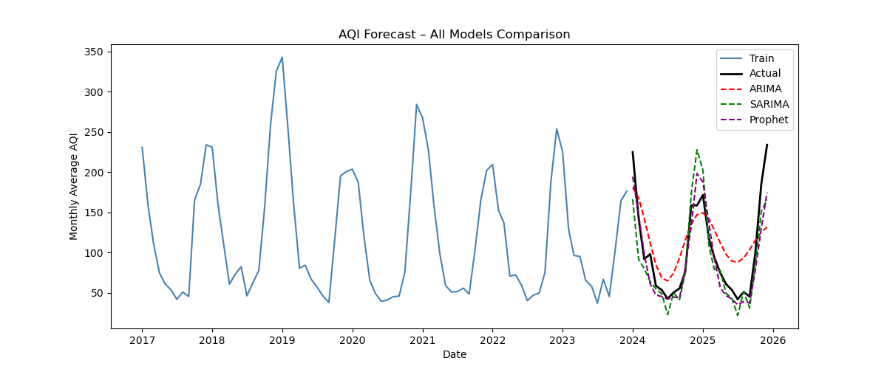
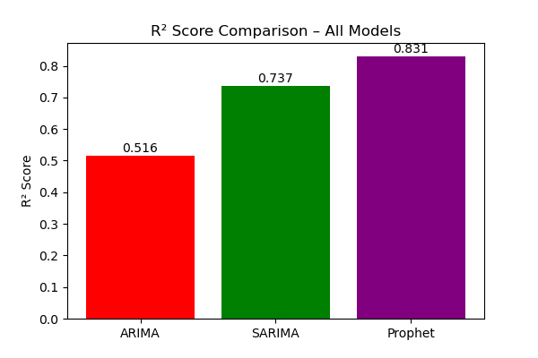
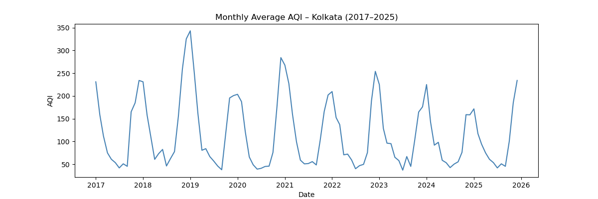
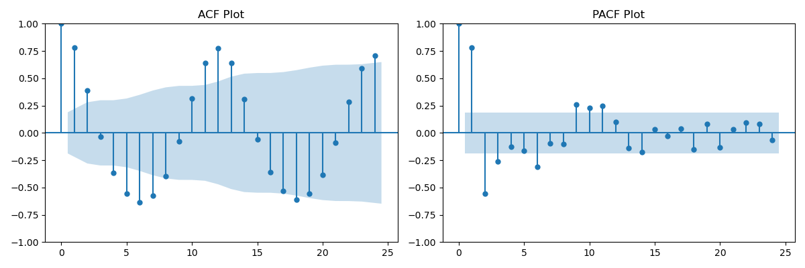

# 🌍 AQI Time Series Forecasting

Air Quality Index (AQI) Forecasting project using **ARIMA, SARIMA, and Prophet** models to predict future AQI trends for **Kolkata (2017–2025)**.

---

## 📌 Project Overview

This project focuses on forecasting the Air Quality Index (AQI) using classical and modern time series forecasting techniques.

The workflow includes:

- Data Collection & Cleaning
- Exploratory Data Analysis (EDA)
- Time Series Decomposition
- Stationarity Testing
- ACF & PACF Analysis
- Model Building using ARIMA, SARIMA and Prophet
- Model Evaluation using R² Score
- Future AQI Forecasting

- ---

## 🛠️ Technologies Used

- Python
- Pandas
- NumPy
- Matplotlib
- Seaborn
- Statsmodels
- Prophet
- Scikit-learn

---

## 📂 Project Structure

```
AQI-Time-Series-Forecasting/
│
├── Data/
│   ├── AQI_daily_city_level_kolkata_2017.csv
│   ├── ...
│   └── AQI_daily_city_level_kolkata_2025.csv
│
├── Images/
│
├── AQI_Time_Series_Forecasting.html
├── AQI_Time_Series_Project_Report.pdf
└── README.md
```

---

## 📊 Dataset

- **City:** Kolkata
- **Duration:** 2017–2025
- **Frequency:** Daily observations converted into Monthly Average AQI for forecasting.

- ---

## 🤖 Forecasting Models

Three forecasting models were implemented and compared:

- 🔴 ARIMA
- 🟢 SARIMA
- 🟣 Prophet

The models were evaluated using the **R² Score** to identify the best-performing forecasting approach.

| Model | R² Score |
|-------|---------:|
| ARIMA | **0.516** |
| SARIMA | **0.737** |
| Prophet | **0.831** ⭐ |

**Best Model:** Prophet achieved the highest R² score and produced the most accurate AQI forecasts.

---

## 📈 Key Results

- Monthly AQI trends were successfully analyzed.
- Seasonality and long-term trends were identified.
- Prophet produced the best forecasting performance.
- SARIMA also performed well by capturing seasonal variations.
- Future AQI values were forecasted for the next 6 months.

- ---

## 📸 Project Visualizations

### AQI Forecast Comparison


### R² Score Comparison


### Monthly AQI Trend


### ACF & PACF Analysis


---

## ▶️ How to Run

1. Clone this repository.
2. Install the required Python libraries.
3. Open the notebook or HTML report.
4. Run the forecasting workflow.
5. Compare ARIMA, SARIMA, and Prophet model performance.

---

## 📌 Future Improvements

- Forecast multiple cities instead of only Kolkata.
- Deploy the forecasting model as a web application.
- Integrate live AQI data using APIs.
- Improve forecasting using LSTM and Transformer-based models.

---

## 👨‍💻 Author

**Roshan Kumar**

- M.Sc. Statistics & Computing, BHU
- Aspiring Data Analyst
- Skills: Python | SQL | Power BI | Machine Learning | Time Series Forecasting

---

⭐ If you found this project useful, consider giving it a star!
